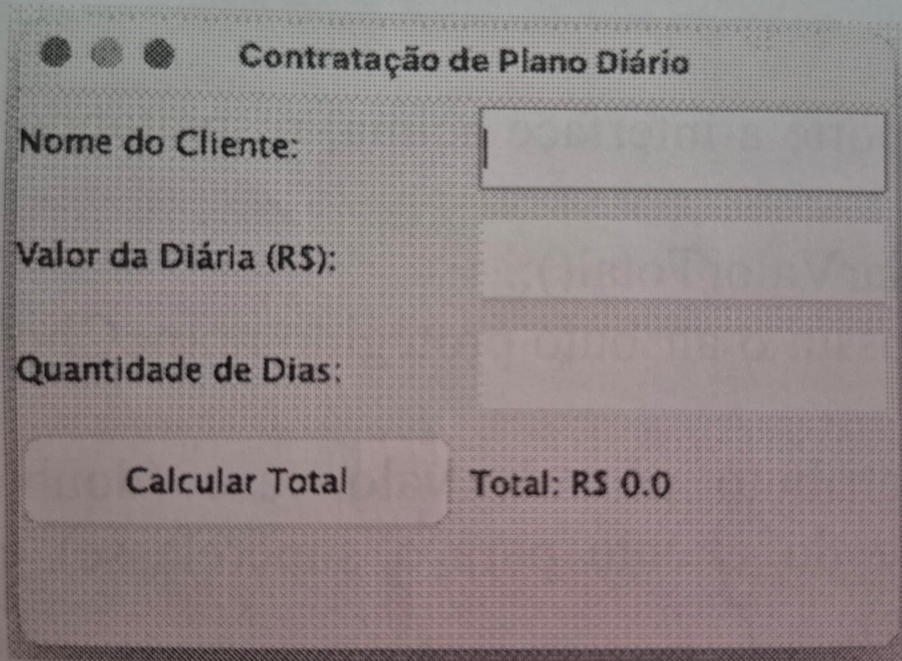

## (5,0 pontos)

Uma equipe de desenvolvimento está criando um sistema para um clube esportivo e de academia. O sistema precisa computar o valor dos planos contratados pelos clientes. Existem dois tipos de planos: o **Plano Mensal** (com preço fixo) e o **Plano Diário** (cujo valor depende do preço da diária e da quantidade de dias contratados). Todos os planos devem seguir um contrato comum para o cálculo do valor.

A interface gráfica do sistema já foi projetada e implementada utilizando Java Swing, conforme o código abaixo:



```java
import javax.swing.*;
import java.awt.*;
import java.awt.event.*;

public class TelaAcademia extends JFrame {
    private JTextField txtCliente;
    private JTextField txtValorDiaria;
    private JTextField txtDias;
    private JButton btnCalcular;
    private JLabel lblResultado;

    public TelaAcademia() {
        setTitle("Contratação de Plano Diário");
        setSize(350, 250);
        setDefaultCloseOperation(JFrame.EXIT_ON_CLOSE);
        setLayout(new GridLayout(5, 2, 5, 5));

        add(new JLabel("Nome do Cliente:"));
        txtCliente = new JTextField();
        add(txtCliente);

        add(new JLabel("Valor da Diária (R$):"));
        txtValorDiaria = new JTextField();
        add(txtValorDiaria);

        add(new JLabel("Quantidade de Dias:"));
        txtDias = new JTextField();
        add(txtDias);

        btnCalcular = new JButton("Calcular Total");
        add(btnCalcular);

        lblResultado = new JLabel("Total: R$ 0.0");
        add(lblResultado);

        btnCalcular.addActionListener(new ActionListener() {
            @Override
            public void actionPerformed(ActionEvent e) {
                // [PARTE 2 DO CÓDIGO]
            }
        });

        setVisible(true);
    }

    public static void main(String[] args) {
        new TelaAcademia();
    }
}

```

---

## SEU DESAFIO:

### Parte 1: Arquitetura de Classes (OO)

Escreva o código em Java para toda a lógica de negócios que dará suporte à interface acima, respeitando as seguintes especificações:

* **1. Contratavel (Interface):** Declara o método público `double calcularValorTotal();`.
* **2. Plano (Classe Abstrata):** Implementa a interface `Contratavel`. Possui o atributo protegido `nomeCliente` (`String`) e o construtor adequado para inicializá-lo.
* **3. PlanoMensal (Classe Concreta):** Estende `Plano`. Possui o atributo privado `valorBase` (`double`), construtor que inicializa todos os campos (repassando o nome do cliente para a superclasse) e a implementação do método de cálculo (retorna o próprio valor base).
* **4. PlanoDiario (Classe Concreta):** Estende `Plano`. Possui os atributos privados `valorDiaria` (`double`) e `quantidadeDias` (`int`), construtor correspondente e a implementação do método de cálculo (retorna a multiplicação da diária pela quantidade de dias).

### Parte 2: Tratamento de Eventos

Escreva o código que deve ser inserido estritamente dentro do método `actionPerformed` do botão `btnCalcular`.